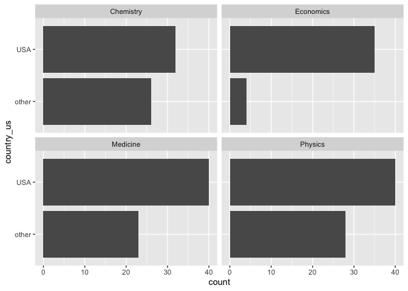

Lab 03 - Nobel laureates
================
Yuxin Xie
1/29/2025

### Load packages and data

``` r
library(tidyverse) 
```

``` r
nobel <- read_csv("data/nobel.csv")
```

## Exercises

### Exercise 1

``` r
dim(nobel)
```

    ## [1] 935  26

``` r
cat("Number of observations:", nrow(nobel), "\n")
```

    ## Number of observations: 935

``` r
cat("Number of variables:", ncol(nobel), "\n")
```

    ## Number of variables: 26

``` r
##there are 935 observations of 26 variables in the dataset.
##each row represents a Nobel Prize laureate 
```

### Exercise 2

``` r
nobel_living <- nobel %>%
  filter(!is.na(country) & gender != "org" & is.na(died_date))
cat("Number of observations in nobel_living:", nrow(nobel_living))
```

    ## Number of observations in nobel_living: 228

### Exercise 3

``` r
#First, we’ll create a new variable to identify whether the laureate was in the US when they won their prize. 
nobel_living<-nobel_living %>%
  mutate (country_us = if_else (country == 'USA', "USA", "other"))

# Next, we will limit our analysis to only the following categories: Physics, Medicine, Chemistry, and Economics.
nobel_living_science <- nobel_living %>%
  filter(category %in% c("Physics", "Medicine", "Chemistry", "Economics"))
```

``` r
#Create a faceted bar plot visualizing the relationship between the category of prize and whether the laureate was in the US when they won the nobel prize.
ggplot (nobel_living_science, aes (x = country_us)) +
          facet_wrap(~category)+ # Facet by prize category
          geom_bar()+
          coord_flip() # Flip the coordinates to make the bars horizontal
```

<!-- -->

``` r
#Economics shows a significant concentration of laureates in the US. Chemistry shows a more balanced distribution between laureates in the US and other countries
```

### Exercise 4

``` r
#Create a new variable called born_country_us that has the value "USA" if the laureate is born in the US, and "other" otherwise. 

nobel_living_science<-nobel_living_science %>%
  mutate (born_country_us = if_else (born_country == 'USA', "USA", "other"))
cat ("Number of winners in four categories born in the US", sum (nobel_living_science$born_country_us=="USA"))
```

    ## Number of winners in four categories born in the US 105

### Exercise 5

``` r
ggplot (nobel_living_science, aes (x = country_us, fill = born_country_us)) +
          facet_wrap(~category)+ # Facet by prize category
          geom_bar()+
          coord_flip() # Flip the coordinates to make the bars horizontal
```

<!-- -->

``` r
# Buzzfeed highlighted that many of the U.S.-based Nobel laureates in the sciences were born outside the U.S. based on this visualization, a large portion of laureates residing in the U.S. were born outside the U.S. 
```

### Exercise 6

``` r
#within the four categories 
nobel_living_science %>%
  filter(country_us == "USA" & born_country_us == "other") %>%
  count(born_country) %>%
  arrange(desc(n))  # Sort by descending count
```

    ## # A tibble: 21 × 2
    ##    born_country       n
    ##    <chr>          <int>
    ##  1 Germany            7
    ##  2 United Kingdom     7
    ##  3 China              5
    ##  4 Canada             4
    ##  5 Japan              3
    ##  6 Australia          2
    ##  7 Israel             2
    ##  8 Norway             2
    ##  9 Austria            1
    ## 10 Finland            1
    ## # ℹ 11 more rows

``` r
#Germany is the most common 
```
